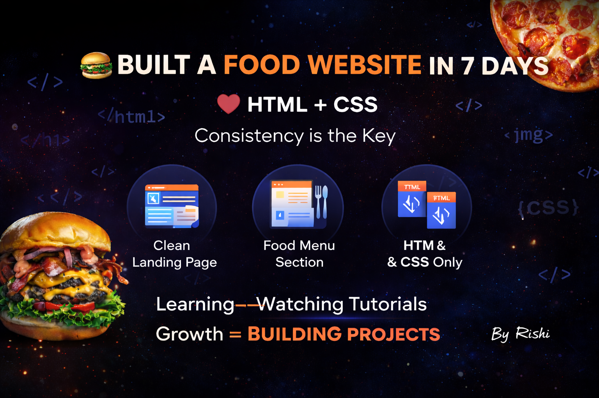

<p align="center">
  
</p>

<h1 align="center">🍔 Food Website Project</h1>

<p align="center">
  🚀 Built with HTML & CSS | 💯 7 Days Consistency | 💻 Beginner Friendly  
</p>

---

## 🔥 Live Preview  
👉 https://rishii-in.github.io/foodwebsitebyrishi/

---

## 💡 About The Project  

This project is a **modern food website** built using only **HTML & CSS**.  

I challenged myself to stop just watching tutorials and actually build something real.  
So I followed a simple rule:  

👉 **1 section per day**  
👉 **7 days of consistency**  

And this is the result. 🚀  

> “Consistency builds what motivation cannot.”  

---

## ✨ Features  

- 🍔 Attractive Landing Page  
- 🍕 Food Menu Section  
- 🎨 Clean & Modern UI  
- 📱 Responsive Layout  
- 📂 Multi-page Website  
- 💯 Pure HTML & CSS (No JavaScript)  

---

## 🛠️ Tech Stack  

- HTML5  
- CSS3  

---

## 📚 What I Learned  

- 🎯 Layout design using Flexbox  
- 🎨 Styling & UI improvements  
- 📦 Structuring real-world projects  
- ⚡ Power of consistency  

---

## 🚀 Getting Started  

Clone the repository:

```bash
git clone https://github.com/rishii-in/foodwebsitebyrishi.git
